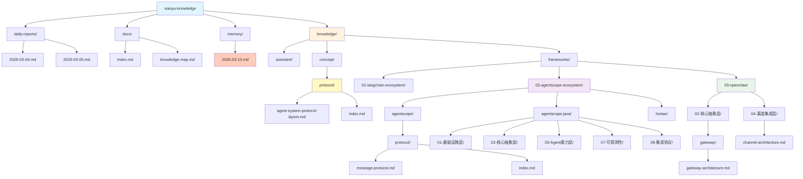

# xiaoyu-knowledge 目录结构

> 生成时间：2026-03-13 23:36

---

## 📊 完整目录树



---

## 🌳 文本目录树

```
xiaoyu-knowledge/
│
├── 📁 daily-reports/                    # 每日日报归档
│   ├── 2026-03-04.md
│   └── 2026-03-05.md
│
├── 📁 docs/                             # 文档
│   ├── index.md
│   └── knowledge-map.md
│
├── 📁 knowledge/                        # 知识库核心
│   │
│   ├── 📁 assistant/                    # Assistant 项目
│   │   ├── 📁 agent/                    # Agent 相关
│   │   │   ├── auto-context-memory.md
│   │   │   ├── event-content-mapping.md
│   │   │   ├── msg-structure.md
│   │   │   └── multi-agent-collaboration.md
│   │   │
│   │   ├── 📁 desktop/                  # Desktop 相关
│   │   │   └── assistant-desktop-设计语言规范与交互检查-v0.1.md
│   │   │
│   │   ├── 📁 eval/                     # 评估框架
│   │   │   ├── 📁 benchmark/
│   │   │   │   ├── agent-benchmark-survey.md
│   │   │   │   └── gaia-benchmark.md
│   │   │   ├── eval-system-design.md
│   │   │   ├── eval-system-impl-plan.md
│   │   │   └── evaluation-framework.md
│   │   │
│   │   ├── 📁 mcp/                      # MCP 相关
│   │   │   ├── 📁 knowledge/
│   │   │   ├── 📁 message/
│   │   │   └── 📁 task/
│   │   │
│   │   ├── 📁 skill/                    # Skill 相关
│   │   └── 📁 web/                      # Web 相关
│   │
│   ├── 📁 concept/                      # ✨ 核心概念（今天新增）
│   │   ├── 📁 protocol/                 # 协议分层
│   │   │   ├── agent-system-protocol-layers.md  # ✨ P0 核心
│   │   │   └── index.md
│   │   ├── index.md
│   │   ├── context-engineering-basics.md
│   │   ├── tracing-basics.md
│   │   └── webflux-thread-model.md
│   │
│   └── 📁 frameworks/                   # 框架研究
│       │
│       ├── 📁 01-langchain-ecosystem/   # LangChain 生态
│       │   ├── 📁 langchain/
│       │   │   ├── 核心架构.md
│       │   │   └── 知识地图.md
│       │   ├── index.md
│       │   └── README.md
│       │
│       ├── 📁 02-agentscope-ecosystem/  # AgentScope 生态
│       │   │
│       │   ├── 📁 agentscope/           # Python 版本
│       │   │   ├── 核心架构.md
│       │   │   ├── 知识地图.md
│       │   │   └── 📁 protocol/         # ✨ 今天新增
│       │   │       ├── message-protocol.md  # ✨ P0 核心
│       │   │       └── index.md
│       │   │
│       │   ├── 📁 agentscope-java/      # Java 版本
│       │   │   ├── 01-基础设施层/
│       │   │   │   └── 消息模型.md
│       │   │   ├── 02-核心抽象层/
│       │   │   │   ├── 工具系统.md
│       │   │   │   ├── 会话管理.md
│       │   │   │   ├── 记忆管理.md
│       │   │   │   ├── 模型抽象.md
│       │   │   │   └── 状态管理.md
│       │   │   ├── 03-Agent能力层/
│       │   │   │   ├── Agent抽象.md
│       │   │   │   ├── 工具注册中心.md
│       │   │   │   ├── 规划系统.md
│       │   │   │   ├── 技能系统.md
│       │   │   │   └── 中断机制.md
│       │   │   ├── 07-可观测性/
│       │   │   │   ├── Studio可视化.md
│       │   │   │   └── Tracing可观测性.md
│       │   │   ├── 08-集成协议/
│       │   │   │   ├── A2A协议.md
│       │   │   │   ├── AGUI协议.md
│       │   │   │   └── MCP协议.md
│       │   │   ├── 扩展机制.md
│       │   │   ├── 知识地图.md
│       │   │   └── assistant-agent-integration-analysis.md
│       │   │
│       │   └── 📁 hiclaw/               # HiClaw 案例
│       │       ├── HiClaw异构智能体协作验证.md
│       │       └── HiClaw-vs-assistant-agent对比.md
│       │
│       ├── 📁 03-openclaw/              # OpenClaw 框架
│       │   │
│       │   ├── 📁 02-核心抽象层/
│       │   │   ├── 📁 gateway/          # ✨ 今天新增
│       │   │   │   └── gateway-architecture.md  # ✨ P0 核心
│       │   │   └── 嵌入式运行器.md
│       │   │
│       │   ├── 📁 04-渠道集成层/         # ✨ 今天新增
│       │   │   └── channel-architecture.md  # ✨ P0 核心
│       │   │
│       │   ├── 知识地图.md
│       │   └── index.md
│       │
│       └── 📁 04-clawdcode-sdk/         # ClawdCode SDK
│           ├── index.md
│           └── README.md
│
├── 📁 memory/                           # ✨ 每日记忆（今天新增）
│   └── 2026-03-13.md                    # ✨ 今日学习记录
│
├── knowledge-card-template.md           # 知识卡片模板
├── freshrss-feeds.md                    # FreshRSS 订阅记录
└── README.md                            # 项目说明
```

---

## 📊 统计信息

### 按分类统计

| 分类 | 文件数 | 占比 | 说明 |
|------|--------|------|------|
| **assistant/** | 30+ | 30% | Assistant 项目相关 |
| **frameworks/agentscope-java/** | 20+ | 20% | AgentScope-Java 框架 |
| **frameworks/agentscope/** | 5 | 5% | AgentScope Python |
| **frameworks/openclaw/** | 5 | 5% | OpenClaw 框架 |
| **concept/** | 5 | 5% | 核心概念 |
| **frameworks/langchain/** | 3 | 3% | LangChain 生态 |
| **memory/** | 1 | 1% | 每日记忆 |
| **其他** | 30+ | 31% | 文档、模板、README 等 |
| **总计** | **100+** | **100%** | - |

### 按优先级统计

| 优先级 | 文件数 | 说明 |
|--------|--------|------|
| **P0（核心）** | 5 | 今天新增的核心卡片 |
| **P1（重要）** | 20+ | 框架核心架构、协议等 |
| **P2（一般）** | 70+ | 详细设计、案例分析等 |

---

## ✨ 今天新增的内容（2026-03-13）

### 🎯 P0 核心卡片（5 个）

1. **concept/protocol/agent-system-protocol-layers.md**
   - 智能体系统协议分层架构
   - 从模型层到应用层的完整协议栈

2. **concept/protocol/index.md**
   - 协议分层概念索引

3. **frameworks/agentscope/protocol/message-protocol.md**
   - AgentScope 消息协议
   - Msg + ContentBlock 统一消息格式

4. **frameworks/openclaw/02-核心抽象层/gateway/gateway-architecture.md**
   - OpenClaw Gateway 总体架构
   - WebSocket 协议设计、认证授权

5. **frameworks/openclaw/04-渠道集成层/channel-architecture.md**
   - Channel 接入总览
   - Provider 抽象层、消息路由

### 📝 记录文件（1 个）

6. **memory/2026-03-13.md**
   - 今日学习记录
   - 知识卡片创建总结

---

## 🎨 目录特点

### 1. 层次结构

```
框架生态 → 具体框架 → 架构层级 → 知识卡片
```

**示例：**
```
frameworks/
└── 02-agentscope-ecosystem/
    └── agentscope-java/
        └── 02-核心抽象层/
            ├── 工具系统.md
            └── 会话管理.md
```

### 2. 命名规范

- **中文命名**：核心概念、架构设计（如 `核心架构.md`）
- **英文命名**：技术实现、代码相关（如 `message-protocol.md`）
- **混合命名**：案例、对比分析（如 `HiClaw-vs-assistant-agent对比.md`）

### 3. 索引文件

每个目录都有：
- `index.md` - 目录索引
- `知识地图.md` - 知识地图（重要目录）
- `README.md` - 说明文档（顶级目录）

### 4. 模板使用

所有知识卡片使用统一模板：
- `knowledge-card-template.md`

---

## 🔍 快速导航

### 想了解协议分层？
→ `knowledge/concept/protocol/agent-system-protocol-layers.md`

### 想了解 AgentScope 消息格式？
→ `knowledge/frameworks/02-agentscope-ecosystem/agentscope/protocol/message-protocol.md`

### 想了解 OpenClaw Gateway？
→ `knowledge/frameworks/03-openclaw/02-核心抽象层/gateway/gateway-architecture.md`

### 想了解 Channel 接入？
→ `knowledge/frameworks/03-openclaw/04-渠道集成层/channel-architecture.md`

### 想查看今日学习记录？
→ `memory/2026-03-13.md`

---

## 📈 发展趋势

### 知识库增长

```
2026-03-04: 初始化
2026-03-05: 添加 Assistant 项目知识
2026-03-11: 添加 AgentScope-Java 详细分析
2026-03-13: ✨ 添加协议分层架构（+7 个文件）
```

### 覆盖领域

- ✅ **智能体框架** - AgentScope、LangChain、OpenClaw
- ✅ **协议设计** - 消息协议、A2A、MCP
- ✅ **架构设计** - Gateway、Channel、运行时
- ✅ **评估体系** - Benchmark、评估框架
- ⏳ **应用案例** - 持续补充中

---

## 🎯 未来规划

### 短期（1 周）

- [ ] 补充 WebSocket vs SSE 详细对比
- [ ] 补充 Spring WebSocket 支持
- [ ] 补充 A2A/MCP 协议详解
- [ ] 补充 CoPaw 架构分析

### 中期（1 月）

- [ ] 添加更多 AI 博客信息源
- [ ] 补充企业级应用案例
- [ ] 完善知识地图
- [ ] 建立知识卡片关联网络

### 长期（3 月）

- [ ] 形成完整的智能体知识体系
- [ ] 支持知识检索和问答
- [ ] 建立自动化知识更新机制

---

_最后更新：2026-03-13 23:36_
