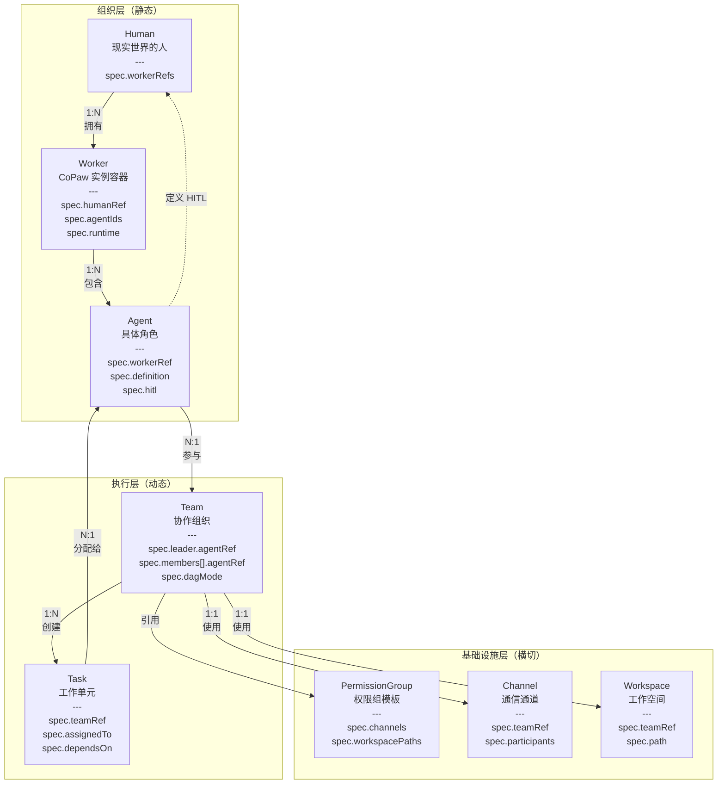

# CoPaw 多智能体集成方案

> HiClaw + CoPaw 融合架构，实现企业级多智能体协作

---

## 1. 背景与目标

### 1.1 集成背景

| 系统 | 定位 | 核心能力 |
|------|------|----------|
| **HiClaw** | Manager-Worker 架构 | 抽象 human-team-worker 的 CRD 多智能体控制管理逻辑 |
| **CoPaw** | 个人助理场景框架 | 1 个实例 → 多个 Agent（个人数字分身） |

### 1.2 集成目标

1. 将 CoPaw 的多智能体能力融入 HiClaw
2. 构建 hiclaw+copaw 组合的典型企业场景案例
3. 提出权限体系构建思路，确保企业落地可行

---

## 2. 架构设计

### 2.1 三层架构模型

```
组织层（静态，描述"有什么"）
  ├── Human             人 
  ├── Worker            Agent 容器（CoPaw 实例）
  └── Agent             具体角色（新增扩展） 

执行层（动态，描述"在做什么"）
  ├── Team              协作组织（Leader + Members，DAG 调度组织）
  └── Task              工作单元（可暂不用 CRD）

基础设施层（横切，支撑以上所有）
  ├── PermissionGroup   权限组模板（新增扩展） 
  ├── Channel           通信通道（可暂不用 CRD）
  └── Workspace         工作空间（可暂不用 CRD）
```

### 2.2 核心实体关系



### 2.3 核心改动内容

1. **Worker 是 Runtime 实例的直接映射，是多 Agent 的容器集合**
   - CoPaw、OpenClaw 等 runtime 的 Worker 实例
   - 一个 Worker 可包含多个 Agent

2. **Agent 是 Worker 内部的具体角色**
   - 新增 `Agent` CRD，扩展 HiClaw 原有模型
   - 支持 HITL（Human-in-the-loop）机制

3. **PermissionGroup 是权限模板**
   - 定义 channels 和 workspacePaths
   - Team 引用 PermissionGroup 获得权限

---

## 3. 典型应用场景

### 3.1 场景一：单席位个人助理

**资源结构**：
```
Human: 小余
  └── Worker: copaw-xiaoyu (CoPaw 实例)
      ├── Agent: planner-assistant (规划助理)
      ├── Agent: writing-assistant (写作助理)
      └── Agent: coding-assistant (编码助理)

Team: 小余的个人团队
  ├── Leader: planner-assistant
  └── Members: [writing-assistant, coding-assistant]
```

**关键特征**：
- 1 个 Human + 1 个 Worker + 多个 Agent
- Human 自己是一个 Team，可灵活调度内部 Agent
- flexible DAG，Leader 自主编排任务

**典型用例**：日计划/周计划、调研报告、数据分析

---

### 3.2 场景二：多席位项目协作

**资源结构**：
```
Human: 小余、王经理、张工、刘总
  ├── Worker: copaw-xiaoyu
  ├── Worker: copaw-wangjingli
  ├── Worker: copaw-zhangong
  └── Worker: copaw-liuzong (可选)

Agent: 
  - pm-assistant (产品助理)
  - dev-assistant (研发助理)
  - market-researcher (市场调研)
  - tech-researcher (技术调研)
  - competitor-researcher (竞品调研)
```

**工作流程示例（商机判断）**：

```
阶段 1：商机判断 Team
  ├── Leader: 小余
  └── Members: [王经理，pm-assistant]
       ↓ 分配
阶段 2：MVP 方案调研
  ├── Leader: 王经理
  └── SubTeam: 调研分析 Team
      ├── Leader: pm-assistant
      └── Members: [market-researcher, tech-researcher, competitor-researcher]
       ↓ 提交调研报告 + 2-3 个 MVP 方案
阶段 3：MVP 研发
  ├── Leader: 张工
  └── SubTeam: MVP 研发 Team
      ├── Leader: dev-assistant
      └── Members: [研发团队 A, 研发团队 B, 研发团队 C]
       ↓ 提交 3 个 MVP 成果 + 交付报告
阶段 4：决策汇报
  ├── 王经理 + pm-assistant 汇总分析
  └── 刘总批准立项决策
```

**关键特征**：
- 总 Team + 子 Team 结构
- Human + Agent 多轮交流
- 多方案并行验证，数据驱动决策
- 参谋体系映射：情报收集 → 方案制定 → 并行执行 → 决策汇报

**价值**：
- 决策速度：2-4 周完成商机评估
- 决策质量：数据驱动，多方案对比
- 资源效率：数字员工承担执行工作，Human 聚焦关键决策

---

### 3.3 场景三：无人值守自动化服务

**关键特征**：
- 无 Human 关联，纯数字员工
- fixed DAG，预设流程严格执行
- 7×24 运行，无需人工干预
- 异常情况自动转人工

**典型用例**：客服、售后、运维

---

### 3.4 三种场景对比

| 维度 | 单席位个人助理 | 多席位项目协作 | 无人值守自动化 |
|------|---------------|---------------|---------------|
| Human 参与 | 1 个 Human | 多个 Human + 数字员工 | 无 Human（纯数字员工） |
| Worker 数量 | 1 个 | 多个 | 1 个（池化） |
| Agent 数量 | 3 个 | 5-10 个 | 5-8 个 |
| Team 结构 | 有 Team（Human 自己是一个 Team） | 有 Team（可通过 Task 协调多个子 Team） | 有 Team |
| DAG 模式 | flexible（Leader 自主编排） | flexible（Leader 自主编排） | fixed（预设流程） |
| 人在回路 | 按需交互（Human 随时参与） | 关键节点（方向确认、质量门禁） | 异常情况（转人工） |
| 典型用例 | 日计划/周计划、调研报告、数据分析 | 项目管理、采购、运营 | 客服、售后、运维 |

---

## 4. 权限安全方案

### 4.1 三层权限模型

```
1. 能力定义（静态）
   Agent.definition.CAPABILITIES.md
   - Skills: [code-review, run-test, deploy]
   - MCP Servers: [filesystem, git, github]

2. 权限授予（动态）
   Team.members[].permissionGroupRef
   - channels: [team-smart-cs]
   - workspacePaths: [/projects/smart-cs/src/**]

3. 运行时检查（实时）
   Agent 执行操作 → 检查能力 → 检查权限 → 检查 HITL
```

### 4.2 权限检查流程

```
Agent 尝试执行操作
  ↓
1. 检查能力（Agent.definition.CAPABILITIES.md）
   ✅ Agent 有这个 skill 吗？
   ✅ Agent 能调用这个 MCP Server 吗？
  ↓
2. 检查权限（Team.members[].permissions）
   ✅ Agent 能访问这个 Channel 吗？
   ✅ Agent 能访问这个文件路径吗？
  ↓
3. 检查 HITL（Agent.hitl）
   ⚠️ 这个操作需要 Human 批准吗？
   → 发送通知给 Human
   → 等待批准
  ↓
允许 / 拒绝
```

### 4.3 HITL 机制

```yaml
# Agent 定义
apiVersion: hiclaw.io/v1beta1
kind: Agent
metadata:
  name: agent-zhang-pm
spec:
  hitl:
    enabled: true
    humanRef:
      name: zhang
    mode: selective                # always / selective / never
    approvalRequired:
      - permission: skills
        operation: execute
        target: deploy              # 执行 deploy 需要批准

      - permission: workspacePaths
        operation: write
        target: /projects/*/config/production/**  # 写生产配置需要批准
```

**HITL 三种模式**：

| 模式 | 说明 | 适用场景 |
|------|------|---------|
| always | 所有操作都需要批准 | 新 Agent、高风险场景 |
| selective | 只有特定操作需要批准 | 正常 Agent |
| never | 完全自主，不需要批准 | 纯数字员工、高度信任的 Agent |

### 4.4 实现要点

1. **CoPaw 层**：在工具调用前检查权限（filesystem、git、skills）
2. **HiClaw 层**：在 Matrix 消息发送前检查 Channel 权限
3. **HITL 触发**：匹配 `approvalRequired` 规则 → 发送通知 → 等待批准
4. **审计日志**：所有操作记录到 MinIO（操作者、时间、目标、结果）

---

## 5. 关键设计决策

| 决策点 | 方案 | 理由 |
|--------|------|------|
| Worker 定位 | Runtime 实例映射 | 保持 CoPaw 多 Agent 容器特性 |
| Agent CRD | 新增扩展 | 细化角色定义，支持 HITL |
| Team 结构 | 支持子 Team | 适应企业多层级协作 |
| DAG 模式 | flexible + fixed | 兼顾灵活编排和自动化流程 |
| 权限模型 | 三层检查 | 能力、权限、HITL 分离，清晰可控 |

---

## 6. 相关卡片

- [[multi-agent-collaboration]] - 多智能体协同架构设计
- [[msg-structure]] - 消息结构设计
- [[event-content-mapping]] - 事件内容映射

---

**源文档**: [xiaoyu-workspace/documents/multi-agent/CoPaw 多智能体集成方案.md](../../../xiaoyu-workspace/documents/multi-agent/CoPaw 多智能体集成方案.md)

**Created**: 2026-04-07  
**Updated**: 2026-04-07  
**Status**: active  
**Tags**: [multi-agent, HiClaw, CoPaw, integration, enterprise, permission, HITL]
